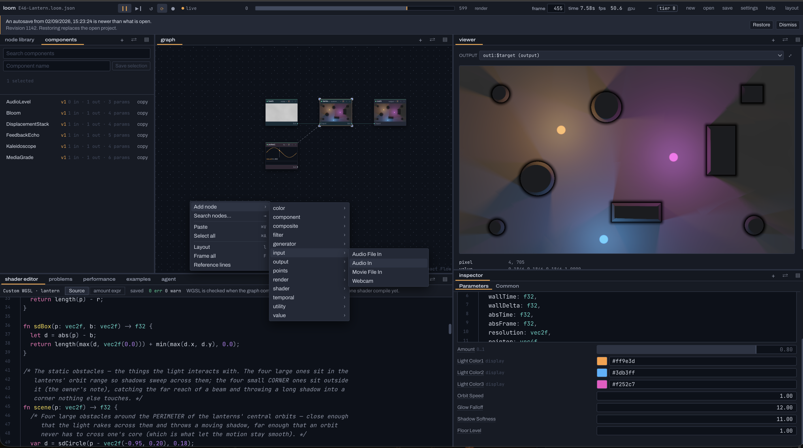

<p align="center">
  
</p>

<h1 align="center">Loom</h1>

<p align="center">
  A browser-based WebGPU node compositor.<br>
  <a href="https://laubsauger.github.io/loom/">Open Loom</a>
</p>

<a href="./docs/loom-editor.png">
  
</a>

<sub>Click the screenshot for the full-size view.</sub>

## Run

Requires Node.js 22+, pnpm 9.15.4, and a WebGPU browser.

```bash
pnpm install
pnpm dev
```

```bash
pnpm lint && pnpm typecheck && pnpm test && pnpm build
```

## MCP

Loom exposes its tools over stdio for desktop clients and through WebMCP in supported browsers.

### Claude

Use this as `.mcp.json` with Claude Code, or merge the `mcpServers` block into your Claude Desktop config:

```json
{
  "mcpServers": {
    "loom": {
      "type": "stdio",
      "command": "/ABSOLUTE/PATH/TO/pnpm",
      "args": [
        "--dir",
        "/ABSOLUTE/PATH/TO/loom",
        "mcp:serve"
      ]
    }
  }
}
```

Replace both paths. `which pnpm` prints the first one. Restart Claude, then ask it to call `bridge_status` and show the current pairing code.

To drive the visible editor:

1. Run `pnpm dev` and open the local Loom URL.
2. Open the **agent** pane and find **Connections**.
3. Enter the pairing code from `bridge_status`.

Until the tab is attached, the MCP server works on its own headless document. The bridge accepts local Loom tabs only, not the GitHub Pages site. For headless pixel and readback tools, append `--grant-export` to the config's `args`.

[Claude MCP docs](https://code.claude.com/docs/en/mcp)

### WebMCP

1. Enable `chrome://flags/#enable-webmcp-testing` and relaunch Chrome.
2. Open Loom with a WebMCP-capable browser agent or extension.
3. Check **agent → Connections**. Loom registers its tools automatically; there is no pairing code.

[Chrome WebMCP setup](https://developer.chrome.com/docs/ai/webmcp)

## Deploy

Deployment is manual. Once the changes are on `main`:

```bash
pnpm deploy
```

## What is in it

- Write WGSL in the node editor. Fields in `struct Params` become typed controls automatically, including colour pickers. Those controls can be driven by the graph or published from a component.
- Build feedback loops, frame caches and slit scans. Pause, step or scrub them on the same frame clock used for MP4 rendering.
- Feed microphone or audio files into level, four frequency bands and onset. LFOs, expressions, envelopes and beat patterns plug into the same parameter system.
- Run custom point kernels on the GPU with named attributes, spawn and kill, compaction, fields, rays and indirect drawing. Render the result as points, instances or meshes.
- Build 3D scenes with cameras, lights, projectors, shadows, ambient occlusion, environment maps and unlit, Phong, PBR or glass materials.
- Bring in stills, video and webcams. Run depth and pose inference in the browser, then use the results in texture and point graphs.
- Turn a selection into a versioned component, then publish the controls its instances should expose.
- Preview any branch, pop panes into their own windows, save layouts, export stills or render a frame range to MP4.
- Drive the open document from the UI, MCP or WebMCP through the same command surface. Changes remain visible and undoable.
- Save versioned `.loom.json` projects, with autosave recovery if the tab disappears.

Loom's core GPU runtime is built on [vGPU](https://vgpu.sh/) by Vercel Labs.

[Spec](./SPEC.md) · [Examples](./examples/README.md)
