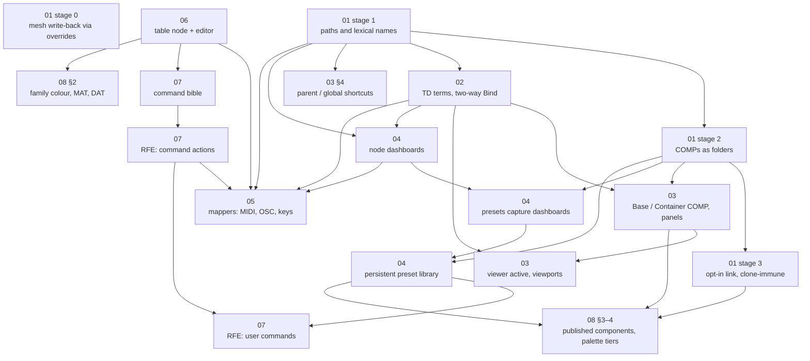

# The COMP model: a proposal (2026-10-06)

*A design proposal to the maintainer from a contributor's fork. Nothing here is a §T row or a §V invariant until the orchestrator says so. Every "Proposed §T rows" block uses placeholder numbers.*

## In one paragraph

Loom borrows TouchDesigner's idiom but not its container model. Every Loom component is a linked clone of a definition that lives outside the network; it cannot carry its own controls, its names leak into the whole document, and loaders cannot write into it. This proposal adopts TouchDesigner's COMP model:
- **COMPs are folders.** A COMP is a folder of real nodes with paths; Base and Container COMPs give it a panel and panel inheritance; linking to a master is opt-in, like TD's Clone.
- **TD's parameter modes.** Constant, Reference and a two-way Bind, defined as TD defines them.
- **Dashboards.** Every node gets a Resolume-style dashboard of normalized controls that its parameters reference over their own ranges.
- **Mappers.** MIDI, OSC and keys each get a mapping table, with feedback to the hardware.
- **Tables.** A table data type (a DAT analog) with one Lister-style editor sits under all of it.
- **The command bus.** A generated command bible, and later command arguments on triggers and user-defined commands.
- **Families and the palette.** Stronger family colour, MAT and DAT families, and a three-tier component palette (built-in, community, local) that you publish to by opening a PR.

It is staged so that each piece ships alone, and stage 0 is a small fix that needs no model change.

## How to read it

| Doc | What it proposes | Read it if… | Flag |
|---|---|---|---|
| [01. COMPs as folders](01-comps-as-folders.md) | Components become folders of real nodes with paths; linking to a master is opt-in; the evidence from a real project; stages 0–3 | You read one document. Everything else stands on this | **⚑ Please read: needs a ruling** (replaces §V79) |
| [02. Terminology and parameter modes](02-terminology-and-parameter-modes.md) | Adopt TD's words (COMP, custom parameter, Container, bind…); Constant / Reference / Bind, with Bind two-way; migrate today's one-way `bind` | You own the parameter resolver or the expression grammar | **⚑ Please read: needs a ruling** (changes `bind`'s meaning, amends §V81) |
| [03. Base and Container COMPs](03-base-and-container-comps.md) | A COMP owns its panel; Container layout and panel inheritance; per-parameter presentation; viewports; Common page with parent and global shortcuts | You own Panels, the Controls pane or the phone door | ⚑ Please read (replaces the Panel node) |
| [04. Dashboards, presets, library](04-dashboards-presets-and-library.md) | Unassigned normalized dashboards on every node; presets capture them; a persistent preset library shared by all projects | You own presets (§T1505b overlaps) | ⚑ Please read (overlaps §T1505b) |
| [05. Mappers](05-mappers.md) | MIDI, OSC and keys each get a table and a learn mode; feedback out; missing-target resolution; additive import | You own MIDI (T1388b phase 2 is the base) | Skim |
| [06. Tables](06-tables.md) | A table node (DAT analog), TSV/CSV/JSON/XML, one Lister-style editor ported from [drmbt/TD-table-editor](https://github.com/drmbt/TD-table-editor) | You want a piece that can start now | Skim; independent |
| [07. Command bus](07-command-bus.md) | Why no eval; what a bus command is; a generated command bible; RFEs for command arguments and user-defined commands | You own the bus or the agent surface | Skim; RFE-level |
| [08. Families, colour, palette](08-families-colour-and-palette.md) | Family colour matching the port hue; MAT and DAT families; "component" = a published, versioned COMP; built-in / community / local palette tiers with publish-as-PR | You own node styling or the library | ⚑ Please read §2.1 (reverses T712's "very subtle") |
| [09. Versioned save](09-versioned-save.md) | Mod+S follows TD: the previous numbered file moves to `Backup/`, the index bumps, and the unnumbered file is always the latest | You own project save | Skim; independent |

## Why these depend on each other

What each arrow means:

- **Stage 0 depends on nothing.** It fixes the mesh bug inside today's model and can ship this week.
- **Paths come before everything that addresses something** (stage 1 → mappers, dashboards, shortcuts, bind across COMPs, command actions). Today names are global and silently renumbered on collision (B41), so a mapping, a reference or a shortcut aimed inside a COMP can bind the wrong node. Every later piece is a way of pointing at a parameter, and paths make the pointer unambiguous.
- **Folders come before panels, local presets and the library** (stage 2 → 03, 04). A panel, a preset bank or a library entry that belongs to a COMP has to be stored *in* it, and today a component's insides aren't document nodes. Folders are also what make write-back, bypass and the inspector work on inner nodes without special cases.
- **Opt-in linking comes last among the structural stages** (stage 3). It reintroduces reuse on top of folders, so it needs folders to exist and is the only stage that replaces §V79.
- **Two-way Bind comes before panels, viewports, dashboards and mapper feedback** (02 → 03, 04, 05). A panel control, a viewport, a mirror surface and a feedback fader all have to *show* a value that can change anywhere and *edit* it without breaking anything. That is the definition of a bind. Without it each of them needs its own sync code, which is today's dead-inspector problem in four places.
- **Dashboards come before mappers** (04 → 05) because a dashboard control is the persistent target a mapping should point at, so rewiring a rig never breaks its MIDI.
- **The table type comes before mappers and the command bible** (06 → 05, 07) because both *are* tables in one editor. It depends on nothing, so it can start in parallel with stage 1.
- **The command bible comes before command actions, and actions before user commands** (07). An action names a command and has to be checked against that command's schema and trigger-safe flag, which the bible makes visible. A user command is a sequence of actions, so it can live in the library.

Parallel tracks the dependencies allow: {stage 0}, {stage 1 → 02}, {06 → 07's bible}, {08's family colour and MAT split}, {09's versioned save}, then the rest as the graph frees them.

## Risks across the whole proposal

- **Trust in shared files.** A Container that carries a stylesheet, and later script widgets, would load from files other people share, including on the phone remote over the LAN. Proposed: declarative presentation plus CSS scoped to the panel (no remote `url()`); script widgets only in a later stage, in a sandboxed iframe that talks to the bus through a narrow message API. This needs a maintainer ruling.
- **Controls as nodes vs parameters as truth.** Widget nodes publish channels that anything can read. Moving control to custom parameters and dashboards needs an equally easy "read this from elsewhere": paths (`op('rig').par.tilt`) and shortcuts (`op.Desk.par.intensity`).
- **Hotkeys in a browser tab.** Mod+Shift+M/O/K and Mod+Alt+M/O/K are free in Loom's keymap (only Mod+K is taken, `src/editor/keymap/defaults.ts:444`). Some are claimed by browsers (Chrome: Ctrl+Shift+O opens its bookmark manager); the desktop build can claim them all, and the keymap is data, so they stay rebindable.
- **Migration surface.** Every stage migrates on load ("parse forever, emit never", §T897's pattern), and each needs an equivalence gate that asserts both sides *resolved* (§V821).
- **Scope.** This touches the frozen `src/domain/types` contract and several §V invariants. That is the maintainer's call, which is why it is a proposal and not a build.

## Where it came from

The evidence comes from a stage-previz project on the contributor's fork. Packaging a 94-node projector, haze and LED network into six components hit every limit in [01](01-comps-as-folders.md) §2. The full workaround inventory is there: nine mesh loaders kept at the root, 24 widget nodes and 28 boundary-crossing expressions, 17 Constant "knob" holders, and a projector rig that cannot be one reusable component instanced three times. Related contributor rows: VN10 (a component has no panel), VN14 (drag a control onto a parameter to reference it), VN15 and VN16 (presets of controls), VN19 (more widget kinds).
